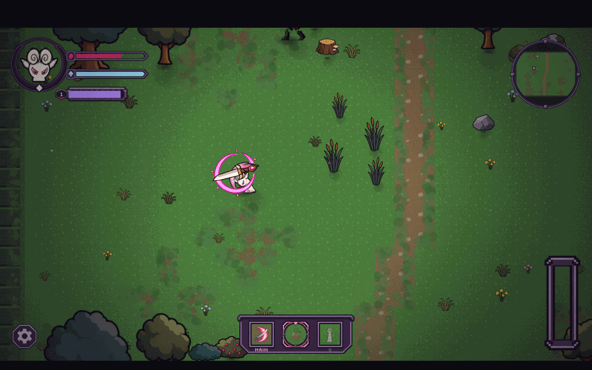
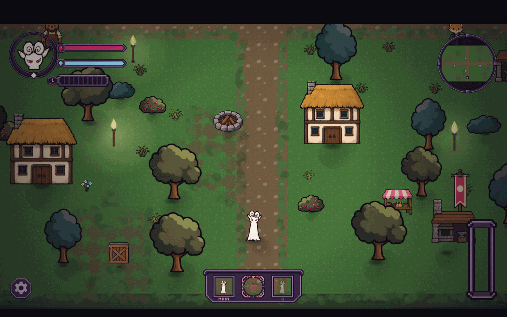

<div align="center">

# Mirrorbound

### A top-down roguelite whose companion learns to fight like you — and whose final boss uses that against you.

Built in three and a half days by a team of five.

`Python` · `FastAPI` · `WebSockets` · `TypeScript` · `React 19` · `Phaser 4` · `Vite`

</div>

---

<div align="center">
  
</div>

---

## The idea

Most games with a companion give you a script. Follow the player. Attack what the player attacks. Stand here.

Mirrorbound gives you a **Twin** instead. It watches how you actually play — how close you fight, how often you swing, whether you retreat at 80% health or 15%, whether you reach for a staff or a sword — and it slowly becomes a version of you. Not a copy of your last twenty inputs. A statistical read on your *style*, built up over a whole run, and weighted by how confident it is that the read is real.

Then you reach the Mirror Sanctum, and the final boss is that same model pointed back at you.

The Twin is not a language model and it is not a neural network. It is a **utility-scored agent over an online-learned behavioural model** — closer to how game AI and recommender systems actually work than to anything with a prompt. Everything it knows, it learned from you, this run, in real time. Press `F3` at any point and you can read the whole thing:

<div align="center">
  
</div>

> **Your Profile** — nine traits, bar opacity showing confidence.
> **What the Twin has learned** — its own drifting style, and how many outcomes it is based on.
> **What it expects next** — the Markov prediction, and how sure it is.
> **Habits** — repeated action sequences it has decided are real.

---

## Screenshots

<table>
<tr>
<td width="50%"><br><b>Combat.</b> Server-authoritative hitboxes, arcs measured against the drawn body.</td>
<td width="50%"><br><b>Exploration.</b> Six areas, procedurally dressed from a deterministic seed.</td>
</tr>
<tr>
<td width="50%"><br><b>Skills.</b> Four trees, twelve nodes, full respec at the village.</td>
<td width="50%"><br><b>Inventory.</b> Two weapons at a time — and the Twin can carry your spares.</td>
</tr>
<tr>
<td width="50%"><br><b>The campaign.</b> Villages and dungeons, gated on what you've cleared.</td>
<td width="50%"><br><b>Your name, and its name.</b> The village uses both.</td>
</tr>
</table>

---

## How it works, briefly

One rule runs through the whole codebase:

> **Python owns truth. Phaser displays truth. AI suggests intents. The game validates and executes.**

The server runs an authoritative simulation at **60 Hz**. The client sends intents — *move here, swing now, cast this* — and renders whatever comes back. It never decides anything. The AI is held to exactly the same contract: the Twin proposes an intent, and the ordinary game rules decide whether it happens. An agent cannot teleport, cannot swing through a wall, and cannot do anything a player could not.

Between the simulation and the AI sits an **immutable event bus**. Every meaningful thing — a swing, a dodge, a retreat, a hit taken — becomes a frozen event. Nothing downstream can mutate history, which is what makes the same seed replay identically and makes the learning testable.

```
  input ──► Session (60 Hz) ──► GameState ──► snapshot ──► client
                  │                  ▲
                  ▼                  │
             Event bus          Twin executor
                  │                  ▲
                  ▼                  │
      Player model ──► Twin controller (utility AI)
      Prediction   ──► Mirror boss
      Heatmaps
```

**→ Full write-up: [docs/ARCHITECTURE.md](docs/ARCHITECTURE.md)**

---

## The learning, in one page

**Nine traits** describe you: `aggression`, `mobility`, `risk_tolerance`, `preferred_range`, `melee_dependency`, `ranged_dependency`, `spell_dependency`, `defensive_tendency`, `combo_dependency`.

Each one is an exponentially-weighted moving average over events, paired with a **confidence** that grows with sample count and decays with a 75-second half-life. Confidence is not decoration — it *gates the output*:

```python
def confident_value(self, name):
    dim = self.get(name)
    return 0.5 + (dim.value - 0.5) * dim.confidence
```

A trait the model has barely seen returns something near neutral no matter how extreme the raw average is. The Twin acts on what it *knows*, not on what it has merely glimpsed. Stop playing for a while and the confidence decays, and it drifts back toward neutral rather than confidently acting on a stale read.

On top of the traits:

- **Sequence prediction** — order-1 to order-3 Markov chains with back-off, so it can guess your next action from the last three.
- **Pattern detection** — repeated action sequences get promoted to named "habits" once they recur enough to be real.
- **Spatial heatmaps** — decaying grids for where you fight, retreat, dodge, cast, and die.

The Twin runs a **utility AI** over fifteen candidate intents (`ATTACK`, `FLANK`, `PROTECT`, `RETREAT`, `INTERCEPT`, `DISTRACT`, `ASSIST`, `EXPLORE`, dashes, spells…), scoring each one against the situation and its own learned style, with hysteresis so it commits to a decision instead of dithering. It has **nine style dimensions** of its own, pulled in two directions at once: toward imitating you (`IMITATION_RATE = 0.06`) and toward what has actually worked for it (`EXPERIENCE_RATE = 0.12`).

So it is not a mirror. It is a mirror that has its own opinions about which of your habits are worth keeping.

---

## Running it

Python 3.12+ with [uv](https://docs.astral.sh/uv/), and Node 22.22+/24.15+/26+ with npm. Two terminals, from the repository root:

```bash
cd apps/server
uv sync
uv run uvicorn mirrorbound.api.app:create_app --factory --host 127.0.0.1 --port 8000 --reload
```

```bash
cd src/web
npm ci
npm run dev
```

Then open <http://127.0.0.1:5173/>.

`--reload` matters more than it looks. The browser is only a view, so a server running yesterday's code answers today's client perfectly politely — it just rejects every command it has never heard of, which reads in the game as a button that does nothing rather than as a stale process.

The URL carries the save: `?session=player` picks a named one, and `?seed=1234&session=test` starts a fresh reproducible run that ignores checkpoints. Saves live in `apps/server/saves/`, replays in `apps/server/runs/`; both are local and gitignored. More detail in [docs/project-readme.md](docs/project-readme.md).

---

## Playing it

**→ Full guide: [docs/PLAYTHROUGH.md](docs/PLAYTHROUGH.md)**

The short version:

| | |
|---|---|
| `WASD` | move |
| `Shift` | run |
| `J` / left mouse | attack |
| `1`–`4` | abilities from your equipped weapon |
| `E` | talk / interact |
| `I` `K` `C` `M` | inventory, skills, character, world map |
| `F3` | **the AI view — the thing worth looking at** |
| `\` | developer console (`spawn`, and friends) |

Name yourself, take the road out of Hollow Reach, clear the Wakewood Crypt, find the Twin, and keep going until the Mirror Sanctum. Then find out what it learned.

---

## Who built what

Five people, 134 commits, 18–21 September 2026.

| | |
|---|---|
| **Ash Vyagni** | Server foundation — game state, entities, movement and collision, combat, the enemy system, dungeon rooms, the agent boundary, the game loop and WebSocket layer, deployment. |
| **Ujesha Sivaramakrishnan** | The probabilistic player model — traits, n-gram and Markov prediction, spatial heatmaps, pattern detection, event immutability and the determinism proof. |
| **Logesh (medriid)** | Essentially all the art and its pipeline — 90+ hand-drawn sheets, the atlas build, the canvas HUD, vitals, floor composition, weapon and spell art. |
| **Siddharth D** | Integration at scale — the server-driven world renderer, entity views, HUD and menus, the session-loop rewrite with contracts and replay, the campaign of villages and dungeons, potions, vendors, checkpoints, the keybinding table. |
| **Ojas Kulkarni** | The Twin's decision-making and the Mirror boss — the utility AI evaluator, the observation↔player-model loop, style learning, weapon autonomy, boss memory and probing; plus combat-geometry correctness and the integration branch. |

**→ Detailed breakdown, with commits: [docs/CONTRIBUTIONS.md](docs/CONTRIBUTIONS.md)**

---

## By the numbers

| | |
|---|---|
| Server | 85 Python modules, ~11,300 lines |
| Client | 90 TypeScript/TSX files, ~21,500 lines |
| Tests | 467 server, 54 client |
| Art | 156 sprite atlases |
| Content | 13 enemy archetypes, 6 weapons, 12 abilities, 6 areas |
| Simulation | 60 Hz, deterministic, seed-replayable |
