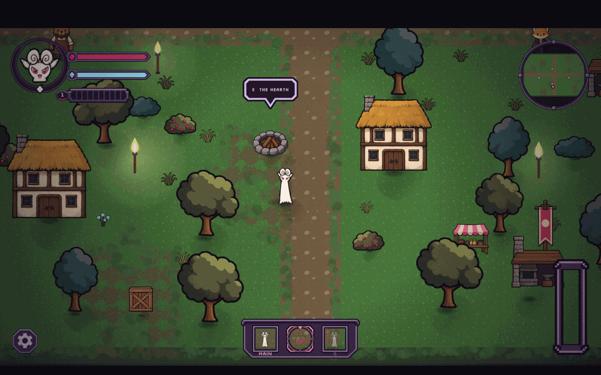
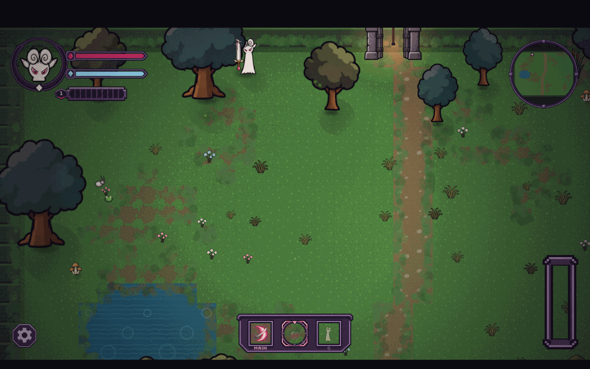
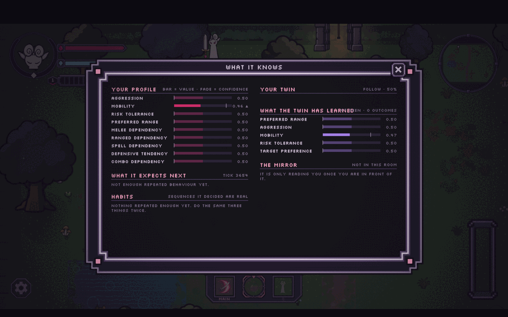
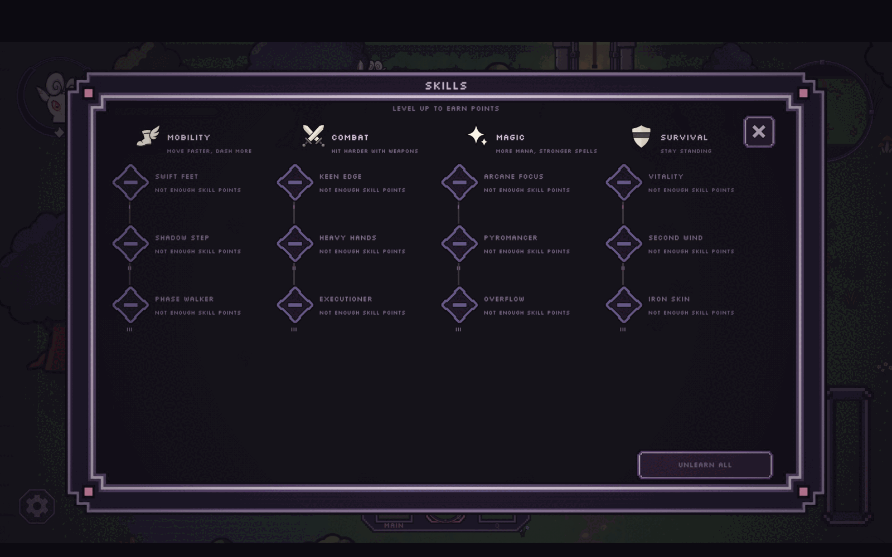
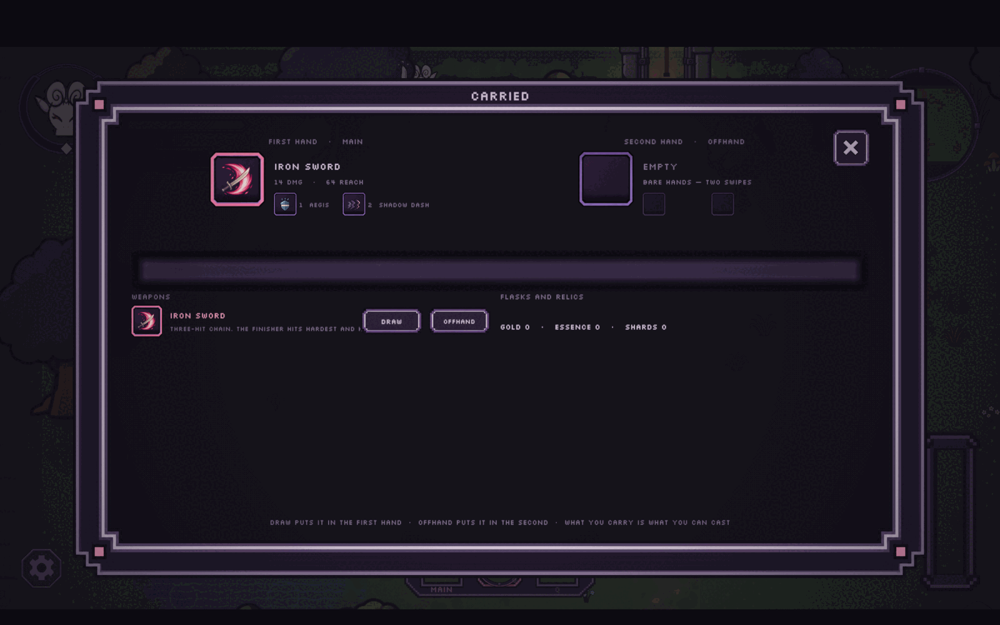
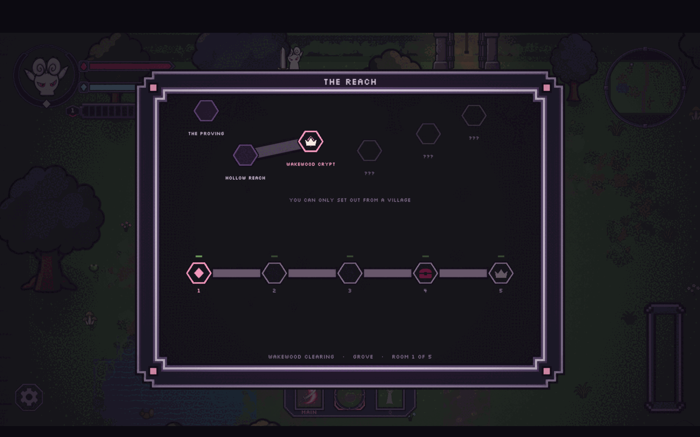

# Playing Mirrorbound

A guide to a full run — what to do, what to watch, and how to make the AI show its work.

---

## Controls

| Key | Action |
|---|---|
| `W` `A` `S` `D` | Move |
| `Shift` | Run |
| `J` *or* left mouse | Attack |
| `1` `2` `3` `4` | Abilities, from whatever weapon you have equipped |
| `Q` | Swap between your two weapons |
| `E` | Talk / interact |
| `F` | Drink a health potion |
| `G` | Drink a mana potion |
| `R` | Turn the potion dial |
| `T` | Call the Twin to you |
| `I` | Inventory |
| `K` | Skills |
| `C` | Character sheet |
| `M` | World map |
| `P` | Pause |
| `F3` | **AI view** |
| `\` | Developer console |
| `Esc` | Back out of anything |

You aim with the mouse. Your facing follows the cursor, so you can back away from something while still swinging at it — which matters more than it sounds, because the Twin is watching whether you do.

Everything here is rebindable from the Controls screen.

---

## Opening: Hollow Reach

You are asked your name. The village uses it, and you can change it later from the character sheet.



**Hollow Reach** is the hub. There are no enemies here and nothing can hurt you. Spend a minute:

- **The elder**, near the crossroads, opens up the campaign and tells you where you can go.
- **The smith** sells and repairs weapons.
- **The apothecary** sells potions. Buy some. You will want them in the crypt.
- **The hearth** in the middle is your checkpoint — press `E`.

Three roads lead out, north. They are gated: **Wakewood Crypt** first, and the others open as you clear areas.

> **Worth doing now:** press `F3` before you fight anything. Every trait reads 0.50 with no confidence, and the panel says it has nothing to predict. That blank slate is the point — come back to it later.

---

## First dungeon: Wakewood Crypt

Walk onto the north road at the left-hand portal. The first room is empty, a deliberate breath before anything happens. The gate at the top leads deeper.



Room two is your first real fight: skeletons, a hollow archer, a gloom hound. The hound is fast and will reach you first; the archer will stay back and shoot. Rooms seal until they are cleared.

**How you fight this matters more than whether you win it.** This is where the model starts forming. Some things it is reading:

- How close you are when you commit to an attack → `preferred_range`
- How often you swing → `aggression`
- Whether you back off when hurt, and at what health → `risk_tolerance`
- Whether you dodge, block, or just trade hits → `defensive_tendency`
- Which weapon you reach for → the three dependency traits

There is no wrong answer. There is only the answer the Twin is going to copy.

The crypt runs about five rooms. Clear it and a portal home opens where you are standing.

---

## Finding the Twin

Somewhere in the Wakewood Crypt, something moves the way you do.

The Twin joins you and you get to name it. From here on it fights alongside you, and this is when the game becomes what it is about.

**Watch it for a while before you judge it.** Early on it has almost no confidence in anything, so it behaves neutrally — it follows, it helps, it does not commit. That is the confidence gate doing its job rather than the AI being dull. Give it a couple of fights.

Then press `F3`.



Reading the panel:

- **Your Profile** — the nine traits. The **opacity of each bar is the confidence**, not the value. A bright bar at 0.80 means it is sure. A faint bar at 0.80 means it has seen two samples and is not committing.
- **Your Twin** — whether it is following, and its current state.
- **What the Twin has learned** — its own style, drifting toward yours, and how many outcomes it is based on.
- **What it expects next** — the Markov prediction. Blank until you repeat yourself.
- **Habits** — sequences you have done enough times that it has decided they are real.
- **The Mirror** — dark until you have met it.

---

## Making the AI visibly learn

If you want to *see* the adaptation rather than take it on trust, play deliberately for a few minutes. It works.

**Try this:** fight nothing but melee, at point-blank, for two or three rooms. Never retreat. Then open `F3`.

- `aggression` climbs and the bar brightens
- `preferred_range` drops toward 0
- `melee_dependency` climbs
- `risk_tolerance` climbs, because you keep swinging while hurt
- The Twin's own `preferred_range` and `aggression` follow yours, a step behind

Now do the opposite for a few rooms — equip a staff, keep your distance, retreat whenever you drop below half health. Watch the traits swing back, and watch the Twin change with them. It will start holding range instead of charging.

**The sharpest demo** is retreat timing. Retreat early and often, and the Twin becomes cautious with its own life. Only ever retreat at death's door, and it fights to the last sliver too. That one is a single learned scalar driving a visible behavioural difference, and you can flip it inside five minutes.

---

## Progression



**Skills** (`K`) — four trees. *Mobility* for speed and dashes, *Combat* for weapon damage, *Magic* for mana and spell power, *Survival* for staying alive. Points come from levelling. You can respec for free at the village, so experiment.

**Inventory** (`I`) — you carry two weapons and swap with `Q`. Your abilities come from what you have equipped, so swapping weapons swaps your whole `1`–`4` bar. Each weapon has its own reach, arc, damage and crit profile, and they genuinely play differently — an iron sword sweeps 115° at 64 units; bare hands, 97° at 48.

**The Twin carries things too.** It picks up weapons it walks past and builds its own arsenal over a run. Ask it from the character sheet and it will hand one over.

**The world map** (`M`) shows the campaign and which areas are open.



---

## The campaign

| Area | |
|---|---|
| **Hollow Reach** | Village hub. Vendors, hearth, three roads. |
| **Wakewood Crypt** | First dungeon. Skeletons, archers, hounds. Where you find the Twin. |
| **Emberfall** | Second village. |
| **Ashen Deep** | Harder dungeon. Brutes, scarabs, acolytes, the Warden's gate. |
| **The Proving** | A gauntlet. |
| **Mirror Sanctum** | The end. |

Enemies are fielded by biome, so each area has its own roster rather than the same creatures recoloured. Thirteen archetypes across the campaign, including elite variants that scale up a base creature.

---

## The Mirror

The Mirror Sanctum is the payoff.

The final boss reads the same player model the Twin does — but with a **longer memory**. The Twin adapts to how you are playing right now; the Mirror has been watching the whole run.

Two things to notice:

**It probes you.** When it cannot read you confidently, it does not guess. It tests you at particular ranges to generate the samples it is missing, then commits to an attack type based on what it found. If you feel like it is sizing you up early in the fight, it is.

**It commits.** Once it has a read it does not re-decide mid-approach. That is what makes it readable enough to counter — and it is deliberate. An enemy that re-rolls its plan every frame is not hard, just unfair.

If you built a habit, it will punish the habit. The counter-play is to notice which of your habits it has learned and stop having them — which is the whole design in one sentence.

---

## The console

Press `\`. Useful for demos:

```
spawn <enemy>      put a creature in the room
```

Tab completes, Enter runs, Esc closes. Spawning is refused in villages — safe rooms stay safe.

Enemies you can spawn include `skeleton`, `archer`, `hound`, `slime`, `acolyte`, `brute`, `scarab`, `warden`, `spitter`, `sprout`, `shardling`, `mirror`, and `dummy` — the practice dummy, which is a real enemy that does not fight back, so the damage numbers coming off it are the real ones.

---

## If you only have five minutes

1. Name yourself, skip the shopping.
2. Take the left road to the Wakewood Crypt.
3. Fight the first room **entirely in melee, never retreating**.
4. Press `F3`. Point at `aggression` and `preferred_range`.
5. Clear one more room, this time **retreating constantly**.
6. Press `F3` again. Point at `risk_tolerance`, and at the Twin's own column moving to match.

That is the whole thesis, and it is visible in five minutes.
